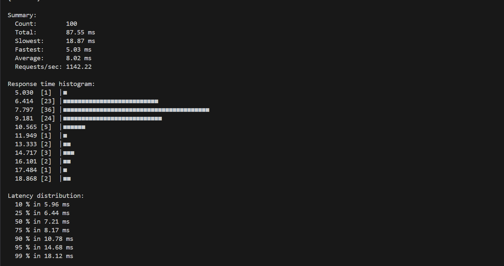

#### Implenting grpc
In order to create the server and client definitions, install the grpcio-tools  and then run second command to generate the Python code

    python3 -m pip install grpcio grpcio-tools

    python3 -m grpc_tools.protoc --proto_path=. myitems.proto --python_out=. --grpc_python_out=.

#### Containerizing the server

In order to containerize the server, the Dockerfile can be built and run  using the following commands:

    docker build -t myitems-grpc:1.0 .
    docker run -d -p 50051:50051 myitems-grpc:1.0

#### Testing
The testing for the grpc code was done using ghz. After running  

    ghz -n 100 --insecure \
    --proto myitems.proto \
    --call myitems.ItemService.GetItemById \
    -d '{"id": 1}' \
    localhost:50051
This is what I got after running the above lines in the console. 

In comparison, I also did the same for the REST service using apache utils.

    ab -n 100 -c 10 http://localhost:5000/items/1

This is what I got after running the following line in the console

For both tests, I tested using -c flag so that I could perform multiple requests (10) at the same time. The average gRPC time ended up being half of what the REST response time was.